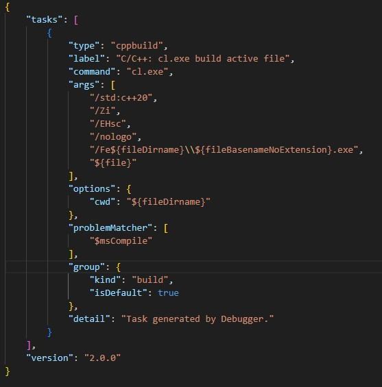
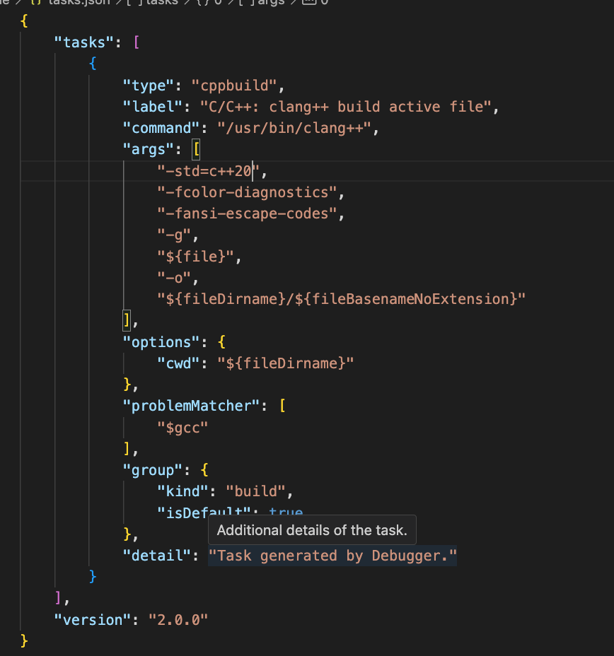
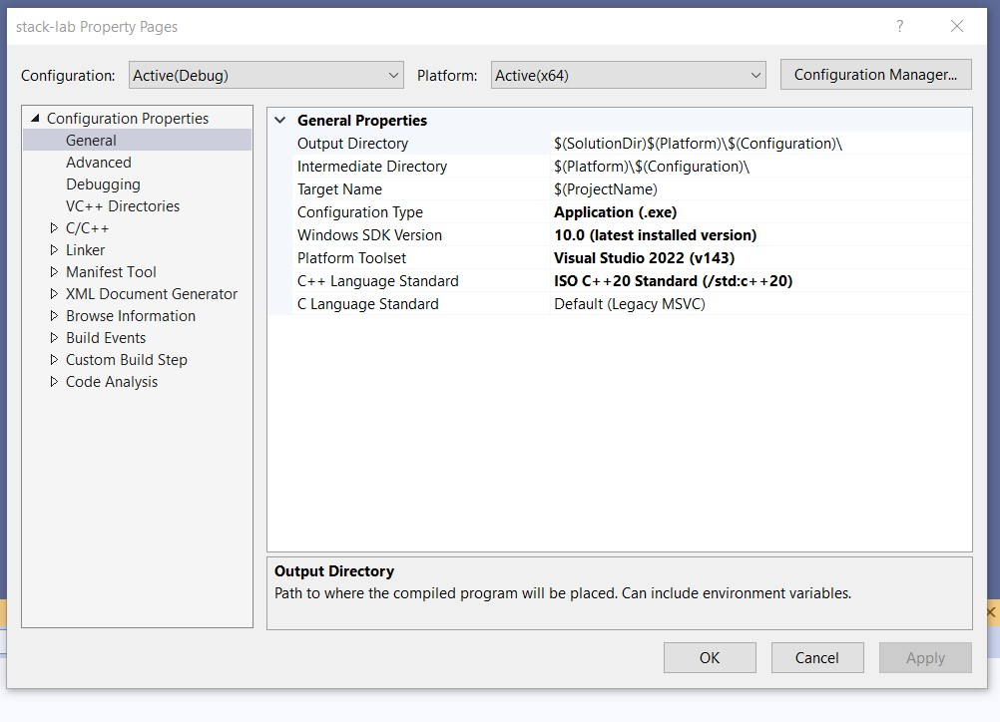

### Updgrade to ISO STD C++ 20
Find your environment and follow the required steps to upgrade to ISO std c++ 20.  Clone this repository and use your IDE to attempt to compile the `main.cpp`.  

**VSCode on Windows and Mac**

After these steps, see the platform specific steps below.

Open the folder that contains the `main.cpp`.

Go to extensions, then type ms-vscode.cpptools in the search bar.

Click on the C/C++ extension, and to the right of Uninstall, there should be a gear icon. Click it.

A dropdown menu should open. Select Extension Settings.

Now click in the search bar (sometimes it makes you click twice before you can type without replacing the extension filter) and type  cppStandard.

From here, you should see two options, one for Cpp Standard, and one for C Standard.

Change Cpp Standard to your desired version. We will use c++20.

[Stack Overflow Reference](https://stackoverflow.com/questions/66680147/how-can-i-change-the-version-of-the-c-language-standard-used-in-vs-code)

**VSCode on Windows**
Try to run the `main.cpp`.  It will probably fail to compile.  If it does fail, then go to the .vscode/tasks.json file and add the command line argument `/std:c++20`.  See snapshot below for reference.

**VSCode on Mac**

Try to run the `main.cpp`.  It will probably fail to compile.  If it does fail, then go to the .vscode/tasks.json file and add the command line argument `-std=c++20`.  See snapshot below for reference.

**Visual Studio 2022 on Windows**

Make a project and add the `main.cpp` to the project.

Go to Properties/C++ and changes your compiler to ISO C++ 20 Standard.

